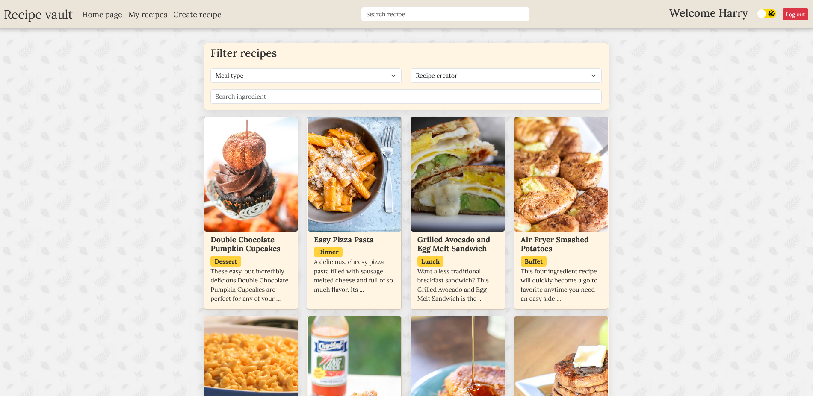
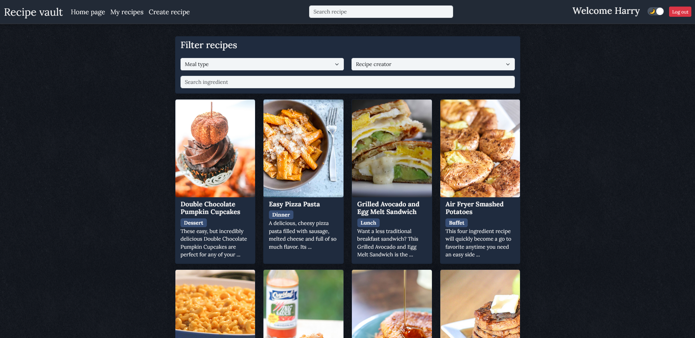
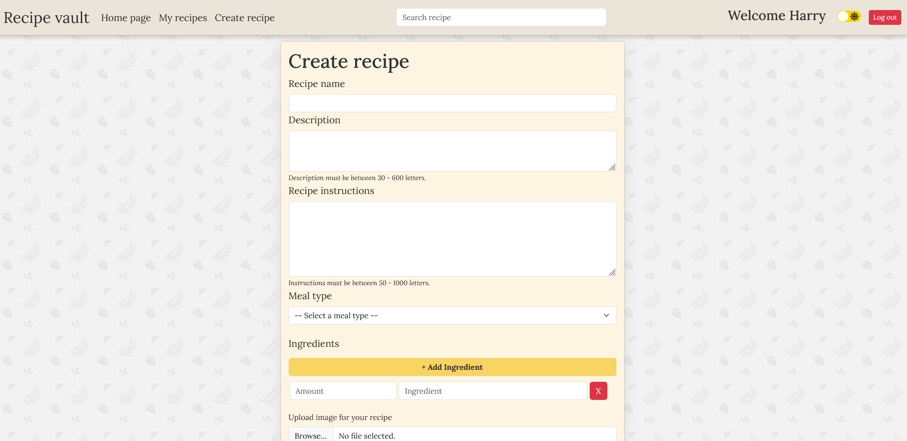
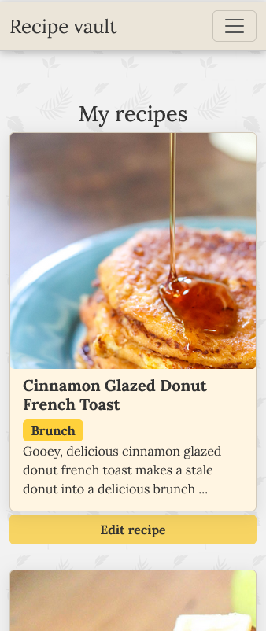

# Recipe vault

Recipe vault is a full-stack web application which allows users to **view, create and share recipes.**

## Frontend

- Built with **React and TypeScript**
- Styled using **Bootstrap**
- Bundled with **Vite** for fast development and builds

## Backend

- Minimal API built with **C#**
- Data stored in a **SQLite**

# Features
- Full CRUD functionality for recipes
- Image upload and deletion
- Search and filter recipes
- User authentication with login-protected pages
- Dark / light mode

## Installation
**1.** Clone repo
```
git clone https://github.com/Botsmarksblocket/recipe-vault.git
```
**2.** Start project
```
npm install
npm run dev
```
**3.** Open your browser at:
```
http://localhost:5173
```

# Log in (Test user)
```
- email: harry@outlook.com
- password: 12345678
```


# Images
<details>
  <summary>Click to view images</summary>

  
  
  
  
</details>
